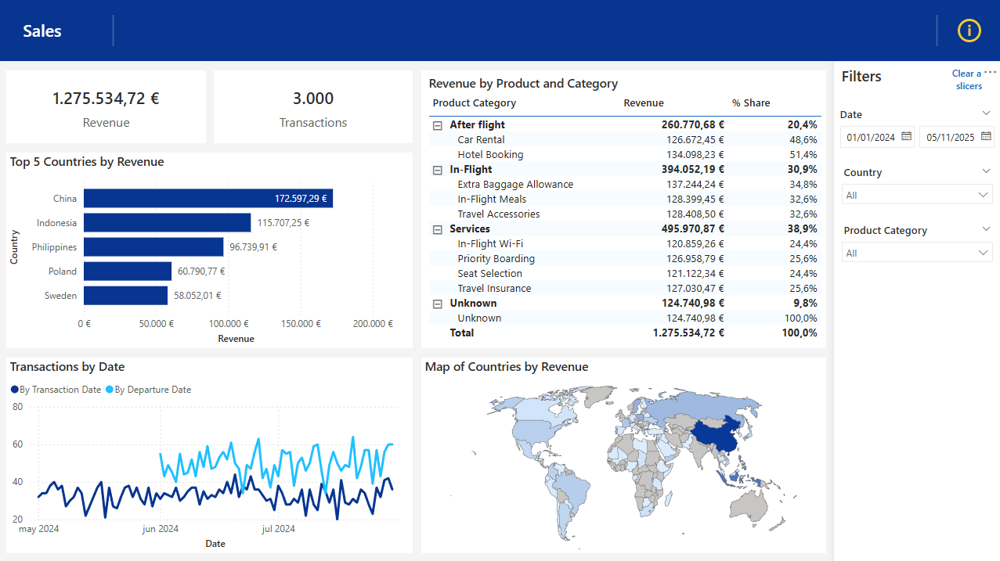

# Technical Test - Power BI Report

## Overview
This repository contains my task for the BI Developer Technical Test. The Power BI report as well all the necessary files to refresh the data. You can find the report in both `.pbip` and `.pbix` formats, under the name **Technical Test**.  

Although `.pbix` files are generally not ideal for storing in GitHub, this report is very small with a simple data model, so there should be no issues. In fact, I **recommend downloading the `.pbix` file**, as it contains the data and is ready to use immediately.

---

## Data Model and Visuals
- The report uses a **Shape Map** visual for the country map.  
  - In Power BI Desktop, you may need to enable it by going to:  
    `File > Options and settings > Options > Preview features` enable **Shape Map visual**.  
  - Shape Map was chosen because I consider it to be more appropriate for this use case and Map and Filled Map visuals will be deprecated soon.  
  - Shape Map is fully supported in the Power BI Service.

---

## Usage Recommendations
- I would recommend downloading the **`.pbix` file**, which already includes the data and can be opened directly in Power BI.  
- If you want to refresh the data, the folder path for source files needs to be updated. It is stored as a parameter in PowerQuery. 

---

## Files in the Repository
- `Technical Test.pbix` – Power BI report with embedded data.  
- `Technical Test.pbip` and assoiated folders – Power BI project template.  
- `Products.xlsx`, `Sales_1.csv`, `Sales_2.csv`, `users.csv` – Source data files. 
- `Power BI test.md` – Task requirements.  

---

